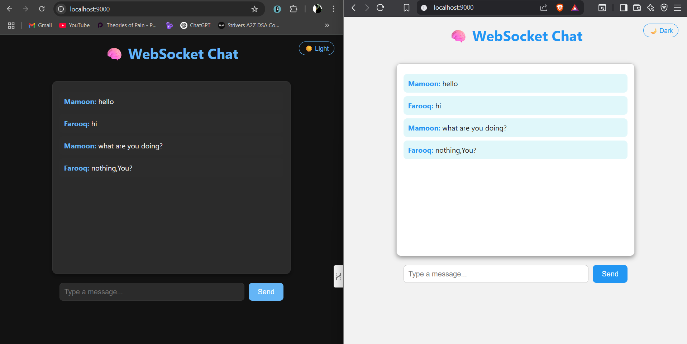

# 💬 Real-Time Chat App

A simple and stylish real-time chat application built with **Node.js**, **Express**, **Socket.io**, and **Vanilla JS**.  
It supports **usernames**, **dark/light mode toggle**, and real-time messaging via **WebSockets**.

---

## ✨ Features

- 🔌 Real-time communication using WebSockets (Socket.io)
- 🧑‍💻 Username prompt on join
- 🌗 Dark / Light theme toggle
- 📱 Responsive & modern UI
- ⚡ Fast and lightweight (no frontend frameworks)

---

## 📸 Preview

  


---

## 🚀 Getting Started

### 1. Clone the Repository

```bash
git clone https://github.com/mamoon124/Chat-app.git
cd Chat-app

2. Install Dependencies
bash
Copy
Edit
npm install
3. Run the App
bash
Copy
Edit
node index.js
The app will run on:
📍 http://localhost:9000

📁 Project Structure
Chat-app/
├── index.js               # Backend server with Socket.io
├── package.json
├── public/
│   └── index.html         # Frontend UI
└── README.md

🛠 Tech Stack
Frontend: HTML, CSS (Vanilla), JavaScript

Backend: Node.js, Express.js, Socket.io

📌 To-Do / Ideas
 Add message timestamps

 Store chat history (in-memory or DB)

 Private messaging support

 Show “user is typing...” indicator

👨‍💻 Author
Made with 💙 by Mamoon Khan

📜 License
This project is licensed under the MIT License.
